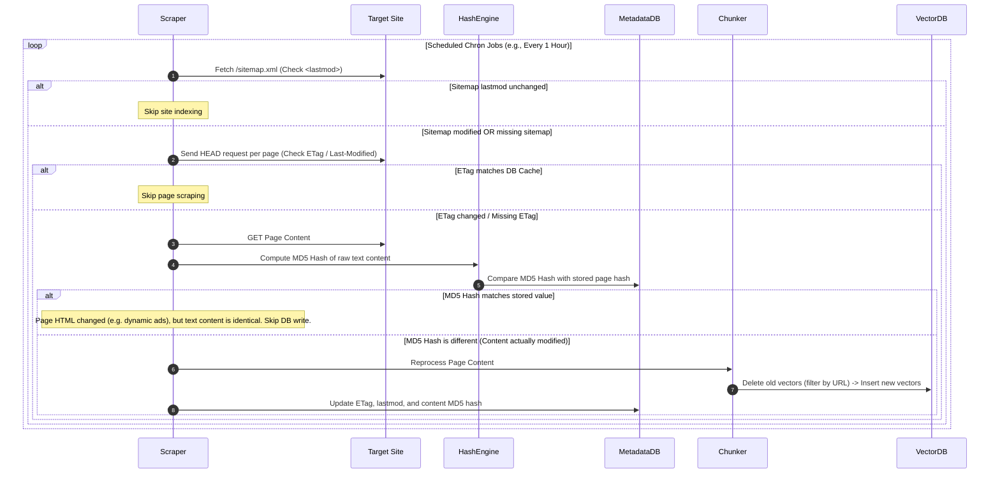

# ProtoAI: Production-Scale Architecture Blueprint
**System Architecture & Multi-Tenant RAG Specification**

This document serves as the formal systems design specification for transitioning the ProtoAI Chatbot from a single-tenant widget into a globally scalable, multi-tenant enterprise solution with dynamic ingestion pipelines, long-term user memory, and sub-second latency controls.

---

## 1. System Architecture Overview

To scale across millions of websites and support massive datasets, ProtoAI decouples UI representation from ingestion and retrieval. The architecture centers around a high-throughput, queue-based **Dynamic Scraping Engine**, a **Multi-Tenant Vector DB Router**, and a hybrid **User Memory System** (short-term state + long-term memory graph).

```mermaid
graph TD
    %% Ingestion Flow %%
    subgraph Ingestion Pipeline (Asynchronous)
        Scraper[Web Crawler / Ingestion Workers] -->|Sitemap/ETag Check| MD5[Change Detector]
        MD5 -->|Diff Detected| Chunk[Semantic Chunker]
        Chunk -->|Generate Embeddings| Embed[Embedding Service: text-embedding-3]
        Embed -->|Write with Tenant ID| VectorDB[(Multi-Tenant Vector DB)]
    end

    %% Runtime Flow %%
    subgraph Runtime Request Pipeline (Synchronous)
        UserWidget[<proto-ai-widget>] -->|Query + API Key / Tenant ID| APIGateway[API Gateway / Router]
        APIGateway -->|1. Validate & Auth| TenantMgr[Tenant Manager]
        APIGateway -->|2. Parallel Queries| RetrievalEngine[Retrieval Engine]
        
        RetrievalEngine -->|Query Vector| VectorDB
        RetrievalEngine -->|Session ID| MemoryDB[(Redis Cache: Chat History)]
        RetrievalEngine -->|User ID| GraphDB[(PostgreSQL: Long-Term Memory Graph)]
        
        VectorDB -->|Top K Segments| PromptBuilder[Prompt Composer]
        MemoryDB -->|Recent Context| PromptBuilder
        GraphDB -->|User Profile/Memories| PromptBuilder
        
        PromptBuilder -->|Optimized Context| LLM[Google Gemini 2.0 Flash]
        LLM -->|SSE Stream| APIGateway
        APIGateway -->|Chunked Response| UserWidget
    end

    classDef database fill:#223,stroke:#3b82f6,stroke-width:2px;
    classDef worker fill:#131,stroke:#10b981,stroke-width:2px;
    classDef runtime fill:#211,stroke:#f59e0b,stroke-width:2px;
    
    class VectorDB,MemoryDB,GraphDB database;
    class Scraper,MD5,Chunk,Embed worker;
    class APIGateway,RetrievalEngine,PromptBuilder,LLM runtime;
```

---

## 2. Scalable Knowledge Retrieval Architecture (RAG)

### Keeping Chatbot Updated with Large Website Datasets

When website scale exceeds the LLM context window (millions of tokens of documentation, product catalogs, and blogs), the system relies on a **Retrieval-Augmented Generation (RAG)** pipeline. Instead of feeding entire websites into the model's prompt, we index the data into smaller chunks and retrieve only the most relevant sections at runtime.

| Parameter / Aspect | Strategy for Large Datasets |
|---|---|
| **Chunking Strategy** | **Semantic Parent-Child Chunking**: Splitting text based on document headers (Markdown/HTML structure) into small child chunks (~256 tokens) for embedding matching, but maintaining references to larger parent blocks (~1024 tokens) for providing full context to the LLM. |
| **Indexing Structure** | Hierarchical Navigable Small World (HNSW) graphs in the vector database to ensure sub-10ms similarity searches across millions of vectors. |
| **Token Optimization** | **Cross-Encoder Re-ranking**: Retrieve top 25 chunks via cosine similarity, run them through a lightweight re-ranker (e.g., Cohere Rerank or BGE-Rerank-M3), and pass only the top 3-5 high-confidence chunks to Gemini. This slashes token counts by up to 70%. |

---

## 3. Continuous Scraping & Ingestion Sync

Dynamic websites (blogs, docs, e-commerce) require real-time knowledge syncing without continuous, expensive re-indexing of unaltered pages.

### Incremental Synchronization Pipeline

To detect and process page updates with minimal overhead, the scraping engine employs a **multi-tiered change-detection filter**:



### Ingestion Lifecycle Rules

*   **Handling Deletes**: When a page is deleted from a website (returns `404` or is removed from the sitemap), the worker issues an atomic delete command in the Vector DB: `DELETE WHERE tenant_id = X AND source_url = Y`.
*   **Rate Limiting / Respect**: To avoid crashing client sites (which could trigger IP blacklisting), crawlers must implement strict polite limits (e.g., max 2 concurrent connections, randomized delays, and respect for `robots.txt`).

---

## 4. Multi-Tenant Architecture & Data Isolation

A single backend cluster must serve thousands of client websites. Strict logical data boundaries are enforced at the database, storage, and retrieval layers to prevent data leaks.

### Tenant Isolation Strategies

1.  **Logical Partitioning (Recommended for Scale)**:
    Every vector in the Vector DB is stored with metadata payloads containing `tenant_id` and `website_id`. Whenever a query is executed, a **hard metadata filter** is enforced:
    ```json
    {
      "filter": {
        "must": [
          { "key": "tenant_id", "match": { "value": "tenant_9a38f822" } },
          { "key": "website_id", "match": { "value": "site_01cf52bc" } }
        ]
      }
    }
    ```
    This ensures the vector search engine never scans vectors belonging to other websites, guaranteeing 100% tenant isolation at negligible overhead.

2.  **Separate Vector Collections**:
    For high-security enterprise tiers, we provision dedicated physical collections or namespaces per tenant inside the vector engine.

### PostgreSQL Database Schema (Multi-Tenant)

To structure websites, pages, and dynamic settings:

```sql
-- Core Tenants
CREATE TABLE tenants (
    id UUID PRIMARY KEY DEFAULT gen_random_uuid(),
    name VARCHAR(255) NOT NULL,
    api_key_hash VARCHAR(64) UNIQUE NOT NULL, -- SHA256 hashed API key used in <proto-ai-widget>
    created_at TIMESTAMP WITH TIME ZONE DEFAULT CURRENT_TIMESTAMP
);

-- Registered Websites per Tenant
CREATE TABLE websites (
    id UUID PRIMARY KEY DEFAULT gen_random_uuid(),
    tenant_id UUID REFERENCES tenants(id) ON DELETE CASCADE,
    domain_name VARCHAR(255) NOT NULL,
    system_prompt TEXT, -- Custom system prompt per site
    scraping_schedule VARCHAR(50) DEFAULT '0 0 * * *', -- Cron string (e.g., daily)
    created_at TIMESTAMP WITH TIME ZONE DEFAULT CURRENT_TIMESTAMP,
    UNIQUE(tenant_id, domain_name)
);

-- Scraping Metadata (Change Detection Cache)
CREATE TABLE scraped_pages (
    id UUID PRIMARY KEY DEFAULT gen_random_uuid(),
    website_id UUID REFERENCES websites(id) ON DELETE CASCADE,
    url TEXT NOT NULL,
    content_hash_md5 VARCHAR(32) NOT NULL,
    etag VARCHAR(255),
    last_modified_header VARCHAR(255),
    last_scraped_at TIMESTAMP WITH TIME ZONE DEFAULT CURRENT_TIMESTAMP,
    UNIQUE(website_id, url)
);
```

---

## 5. User Memory & Session Persistence System

An intelligent chatbot must remember user details (e.g., "The user prefers React over Angular") across sessions, without drowning the context window with raw historical transcripts.

### Memory Decomposition: Short-Term vs. Long-Term

```
                       ┌──────────────────────────────┐
                       │      User Input Message      │
                       └──────────────┬───────────────┘
                                      │
                 ┌────────────────────┴────────────────────┐
                 ▼                                         ▼
    ┌─────────────────────────┐               ┌─────────────────────────┐
    │ 1. Short-Term History   │               │ 2. Long-Term Memory     │
    │ (Conversational State)  │               │ (Persistent Knowledge)  │
    └────────────┬────────────┘               └────────────┬────────────┘
                 │                                         │
    * Stores raw message sequence             * Extracts entities, preferences, facts
    * TTL: 2 Hours (Stored in Redis)          * Persistent in SQL Graph DB
    * Used for flow and core pronouns         * Used for long-term user personalization
```

### Long-Term Memory Extraction Pipeline

At the end of a session (or after a user closes the chat), an asynchronous LLM worker processes the latest chat logs to extract facts and updates the user's permanent profile:

```typescript
// Memory Extraction worker (BullMQ task)
async function extractUserMemories(userId: string, newMessages: Message[]) {
  const memorySystemPrompt = `
    Analyze this conversation transcript. Extract facts, preferences, and details about this user.
    Filter out transient information (like simple greetings).
    Output JSON format: { "add": [{ "fact": string, "category": string }], "delete": [string] }
  `;
  
  const response = await callLLM(memorySystemPrompt, newMessages);
  const { add, delete: toDelete } = JSON.parse(response);

  // Write updates to Postgres User Profile / Graph Store
  await db.transaction(async (tx) => {
    for (const item of add) {
      await tx.insert(user_memories).values({ userId, fact: item.fact, category: item.category });
    }
    for (const id of toDelete) {
      await tx.delete(user_memories).where(eq(user_memories.id, id));
    }
  });
}
```

---

## 6. Full Technology Stack Recommendation

To build, deploy, and scale this system efficiently:

```
  ┌────────────────────────────────────────────────────────┐
  │                        FRONTEND                        │
  │  * Shadow-DOM Custom Element Component (Vanilla TS)   │
  │  * CSS variables / Tailwind encapsulation             │
  └───────────────────────────┬────────────────────────────┘
                              │
                              ▼
  ┌────────────────────────────────────────────────────────┐
  │                    API GATEWAY & BUS                   │
  │  * Next.js App Router API / Fastify (TypeScript)       │
  │  * BullMQ + Redis (Asynchronous crawling/sync queues)  │
  └───────────────────────────┬────────────────────────────┘
                              │
            ┌─────────────────┴─────────────────┐
            ▼                                   ▼
  ┌───────────────────────────┐       ┌───────────────────────────┐
  │      DATABASES & RAG      │       │     VECTOR PROCESSING     │
  │  * PostgreSQL (Tenants)   │       │  * Qdrant / Pgvector      │
  │  * Redis (Short-Term Mem) │       │  * text-embedding-3-small │
  └───────────────────────────┘       └───────────────────────────┘
```

*   **Ingestion Queue**: **BullMQ** (powered by **Redis**). Excellent for managing asynchronous scraping tasks with rate limits, retries, and high concurrency.
*   **Vector Engine**: **Qdrant** or **pgvector (PostgreSQL)**. Qdrant is built for multi-tenant payload filtering out of the box and is extremely fast; pgvector keeps your operational database unified.
*   **RAG Engine**: **LlamaIndex (TS/Python)**. Ideal for structured data chunking, metadata attachment, and flexible node retrieval workflows.
*   **Primary DB**: **PostgreSQL** configured with Row-Level Security (RLS) to enforce separation of tenant data at the query engine level.

---

## 7. Scale, Latency & Cost Optimization

### Sub-Second Latency Blueprint

1.  **Streaming Everywhere**: Always stream tokens from the LLM back to the web component via Server-Sent Events (SSE). The user *perceives* instant response times (under 200ms first-token time) even if the full generation takes 3 seconds.
2.  **Semantic Caching**: Use **GPTCache** or a Redis-based embedding cache. If a new user asks a question that was asked 2 minutes ago (e.g., "What is your refund policy?"), serve the cached answer immediately without calling the embedding model or Gemini.

### Cost Controls

*   **Dynamic Prompt Truncation**: Prune historical dialogue history automatically. Keep the system instruction, the top retrieved vectors, and only the last 4 messages of history in active memory.
*   **Small Embedding Models**: Use highly cost-efficient embeddings like OpenAI's `text-embedding-3-small` (configured to 256 or 512 dimensions) rather than massive high-dimensional models. This reduces RAM overhead in the vector database and cuts embedding costs to near-zero.
