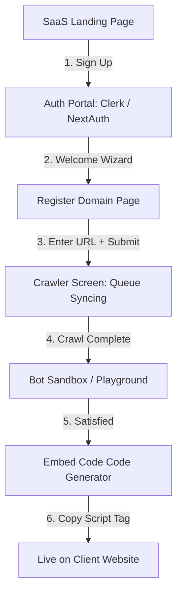
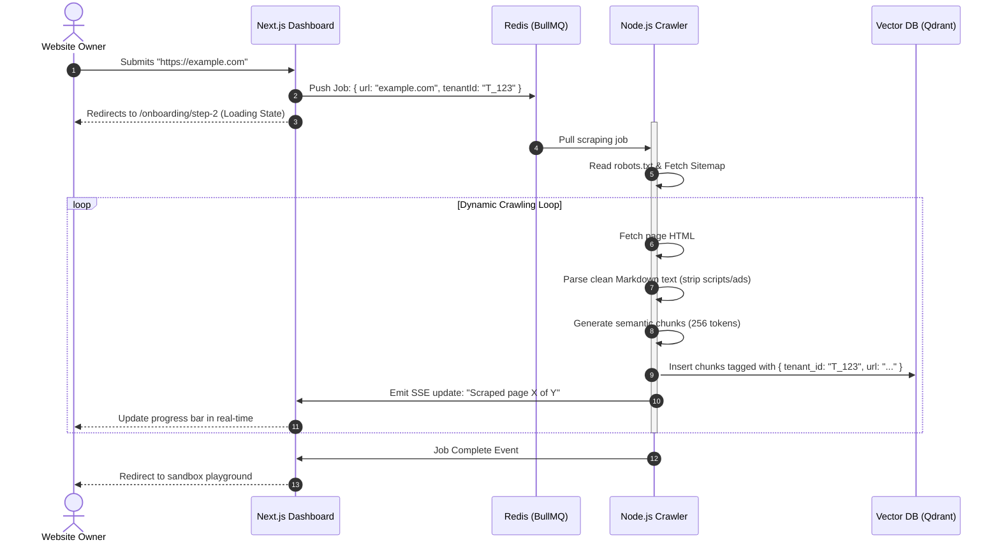

# ProtoAI SaaS Portal: Web Structure & User Journey
**UX Blueprints & Technical Flow for Tenant Onboarding**

This specification outlines how client users (tenants) sign up, register their domain, trigger the background web crawler, verify their chatbot sandbox, and copy-paste their embeddable web component.

---

## 1. Core User Journey Flow



---

## 2. Detailed Dashboard Web Structure

Below is the directory/page structure of your Next.js Dashboard portal (`apps/dashboard`):

### A. Authentication & Onboarding (First-Time Experience)
*   **`/`**: Dynamic SaaS homepage highlighting bot capabilities, analytics previews, and pricing.
*   **`/signup` & `/login`**: Handled via secure libraries like Clerk.
*   **`/onboarding/step-1` (Add Domain)**: 
    *   Simple input field for target site: `https://myblog.com`.
    *   Validation: checks if URL is live and resolves correctly.
*   **`/onboarding/step-2` (Scraping Queue)**: 
    *   Animated dynamic progress page showing live indexing status (*"Discovered 34 links...", "Scraped page 12 of 34...", "Building semantic knowledge vectors..."*).
*   **`/onboarding/step-3` (Playground)**: 
    *   A split-screen playground. On the left: widget customization options (colors, greeting message, system prompt override). On the right: a live preview of the chatbot widget to test the crawled knowledge immediately.

### B. Main Console (Post-Onboarding Panel)
Once onboarded, users land on their persistent dashboard (`/dashboard`):

| Route | View Name | Purpose / Functionality |
|---|---|---|
| `/dashboard` | **Overview** | Daily/monthly total chat sessions, total tokens used, average customer rating, last crawl execution time. |
| `/dashboard/sources` | **Knowledge Base** | View list of crawled URLs, check scraped dates, add manual exclusion rules, upload custom PDFs, or click "Recrawl Now". |
| `/dashboard/customize` | **Widget Styling** | Tweak widget colors, positions (bottom-right vs. bottom-left), rounded corners, placeholder orb images, and welcome message text. |
| `/dashboard/embed` | **Get Widget** | Code-editor snippet component where tenants can copy the single line script to paste into their HTML. |
| `/dashboard/history` | **Conversation Logs** | View anonymous transcript logs of user chats to audit bot accuracy and identify missing knowledge gaps. |

---

## 3. How the Crawler & Widget Integration Works

### The Backend Ingestion Mechanics (Under the Hood)

When a tenant submits their URL (`https://example.com`), the web structure executes the following operations seamlessly:



---

## 4. Copy-Pasting the Embed Snippet

Once crawling is done, the **`/dashboard/embed`** screen presents the client with their custom code block. 

### The Dynamic HTML Embed Code
Every tenant receives a unique `api-key` attribute containing their logical identifier:

```html
<!-- Paste this code block inside your <body> tag -->
<script src="https://cdn.protoai.com/widget.js" defer></script>

<proto-ai-widget 
  api-key="pk_live_839da49e10ffac32a2" 
  theme-color="#4F46E5"
  welcome-msg="Hey there! How can I help you today?">
</proto-ai-widget>
```

### Script Execution on the Client's Live Website
When an external user loads the client's website:
1.  **Script loads**: The `widget.js` compiled script fetches React and registers the custom element `<proto-ai-widget>` inside the browser's global `customElements` registry.
2.  **Element Mounts**: The browser instantiates the `ProtoAIWidget` custom class.
3.  **Shadow DOM Isolation**: The component attaches a Shadow Root, loads its own Tailwind/CSS package, and creates an isolated React root.
4.  **Secure Handshake**: The component reads the attribute `api-key="pk_live_..."` and automatically includes it as an `Authorization` header in all user messaging requests sent to your central API server (`https://api.protoai.com/chat`), serving correct RAG context strictly matching their isolated website dataset.
